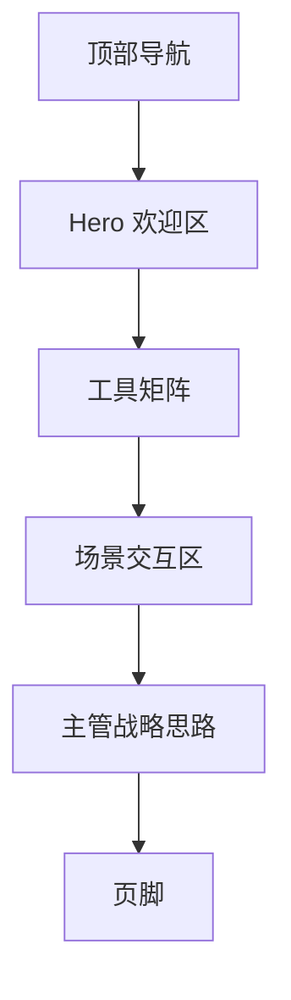

# AI 工具使用指南 UI/UX 美化项目说明 (Spec)

## 1. 构架与选型

- **前端技术**: HTML5, Tailwind CSS, Vanilla JavaScript
- **设计风格**: Premium Glassmorphism (高级玻璃拟态), 极简主义, 科技感
- **字体**: Inter (正文), Outfit (标题)
- **色彩方案**: 
  - 背景: 深色 (#050505) 配合微妙的径向渐变
  - 主色: 电力蓝 (#00D1FF), 霓虹紫 (#9D00FF)
  - 对比色: 白色 (#FFFFFF), 浅灰 (#94A3B8)

## 2. 关键设计改进

### 2.1 视觉增强

- **对比度提升**: 将正文颜色从灰色提升至高亮白，确保在深色背景下的易读性。
- **层次感**: 使用多层 box-shadow 和 backdrop-filter 模拟真实的玻璃质感。
- **微导视**: 增加细微的边框发光效果，引导用户注意力。

### 2.2 交互优化

- **平滑切换**: 标签页切换增加淡入淡出和轻微位移动画。
- **悬停反馈**: 卡片在悬停时不仅有阴影变化，还有微小的缩放和背景透亮效果。
- **导航联动**: 滚动时导航栏的模糊度和透明度动态变化。

## 3. 页面布局说明 (Mermaid 流程图)

## 4. 可行性评估

- 环境支持: 纯浏览器环境，无后端依赖。
- 性能影响: 低，主要使用 CSS 硬件加速动画。
- 风险点: 渐变背景在大屏幕下的性能表现，需优化。
