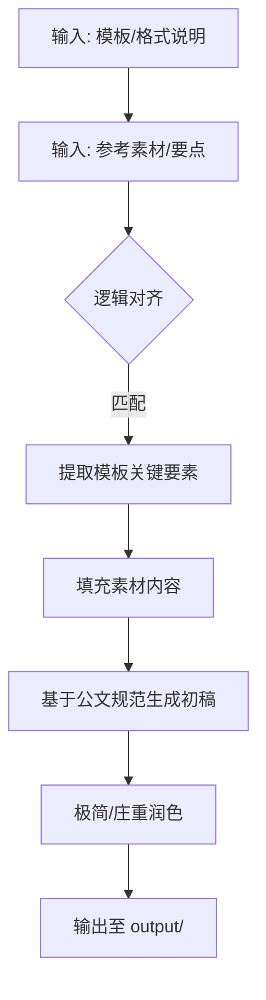
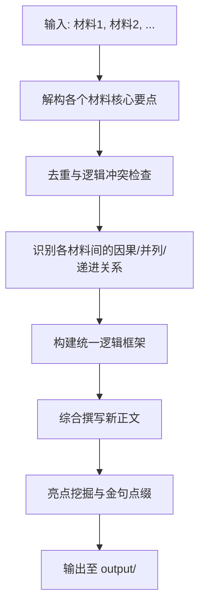
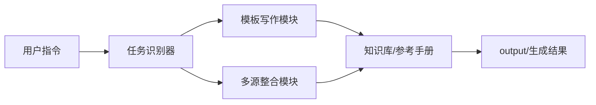

# 写作专家 (Writing Expert) 技术方案说明书 (spec.md)

## 1. 项目背景与目标

本项目旨在打造一个极具实战经验的 AI 公文写作专家，不仅能高效完成基本的公文起草与审核，还具备基于特定模板生成内容以及对多源素材进行深度融合提炼的能力。

## 2. 核心功能扩展

根据最新需求，将在现有能力基础上强化以下两点：

- **精准模板匹配写作**：输入“模板格式”+“基础素材”，AI 自动对齐模板逻辑，补全缺失信息，生成高质量正文。
- **多源素材整合提炼**：输入“多个原始材料”，AI 自动识别共同点、冲突点及逻辑关联，整合为一份结构清晰、论点明确的新材料。

## 3. 关键流程 (Mermaid图)

### 3.1 模板匹配写作流程

### 3.2 多源材料整合提炼流程

## 4. 资料模型

- **输入物 (input/)**: 存放模板文件 (.md)、参考素材、多源原始稿件。
- **知识库 (references/)**: 提供写作规范、行业术语、金句库。
- **输出物 (output/)**: 最终生成的公文或诊断报告。

## 5. 模组关系 (Skill System)

## 6. 技术评估

- **可行性**: 高。LLM 具备极强的理解与逻辑重组能力。
- **风险**: 素材内容过多可能导致 token 溢出或细节丢失。
- **对策**: 采用分块提取要点、多步循环优化的策略。
