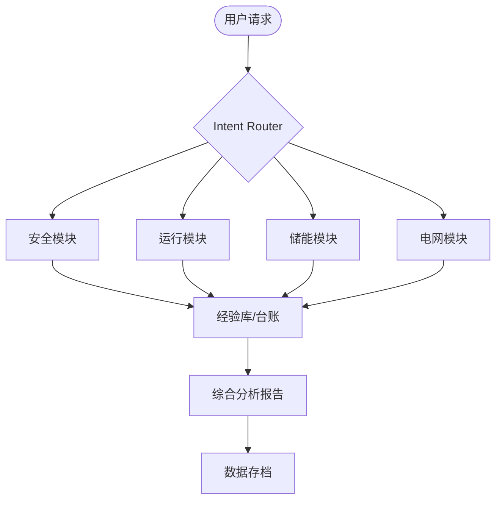

# Spec: 新能源电力专家 (New Energy Power Expert)

## 1. 构架与选型 (Architecture & Selection)

- **核心思想**: 模块化专业领域（Domains）与统一调度（Routing）。
- **技术选型**:
  - **知识库**: Markdown 文件（`references/`, `domains/`）。
  - **数据库**: JSON 文件（`database/`）。
  - **逻辑引擎**: 基于提示词工程（Prompt Engineering）的 LLM。

## 2. 资料模型 (Data Model)

- **场站元数据 (`references/stations.md`)**:

  | 字段 | 说明 |
  | :--- | :--- |
  | 项目名称 | 原始申报项目名称 |
  | 调度名称 | 电网调度命名 |
  | 交流容量 | 交流核定装机容量 (MW) |
  | 直流容量 | 直流装机容量 (MWp) |
  | 区域 | 行政区域划分 |

- **历史数据 (`database/historical_data.json`)**: 存储标准化后的运行指标。
- **可研数据 (`database/feasibility_data.json`)**: 存储项目各年份的可研利用小时与发电量预测。
- **经验库 (`database/knowledge_base.json`)**: 存储从案例中提取的审核规则与教训。

## 3. 关键流程 (Key Workflow)

1. **Verification (验证)**: 加载场站元数据，比对输入数据的一致性。
2. **Routing (寻址)**: 根据意图识别（安全、运行、储能等）加载对应模块规则。
3. **Drafting (诊断)**: 结合经验库进行深度分析，指出问题并引用标准。
4. **Archiving (存档)**: 自动提取核心指标并更新经验库。

## 4. 模组关系图 (Module Relationships)

