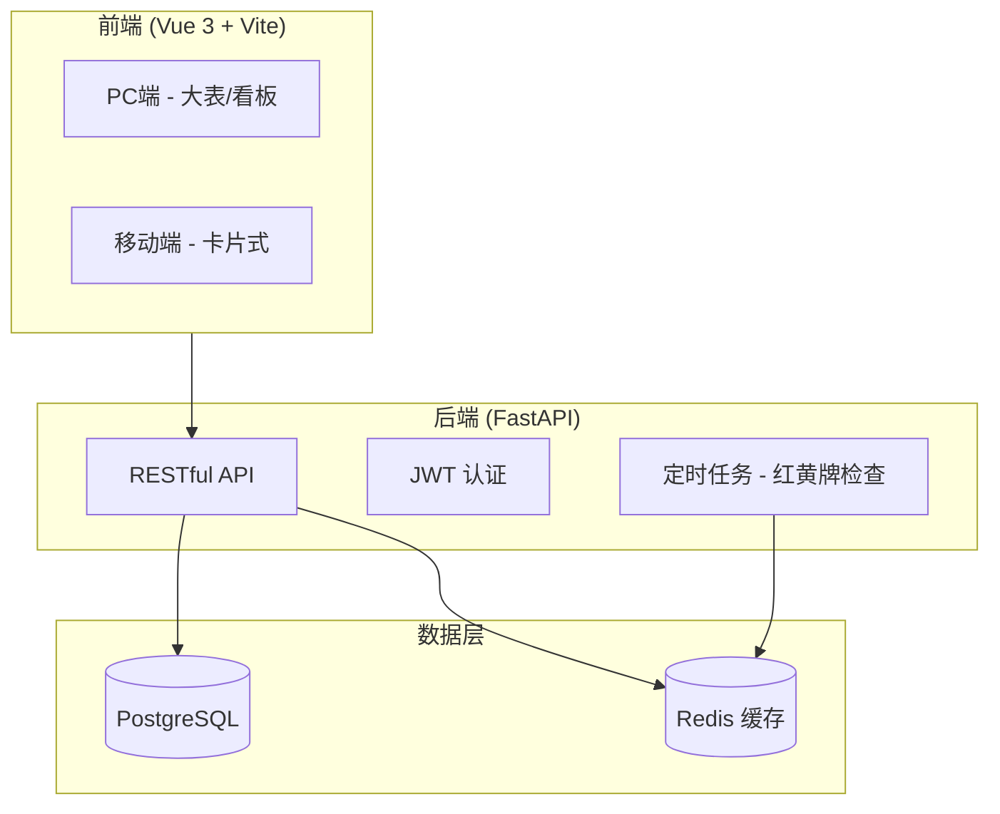
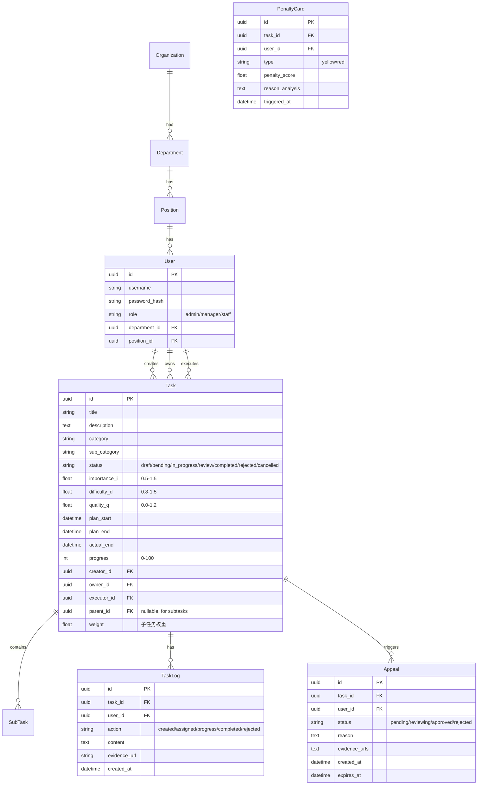
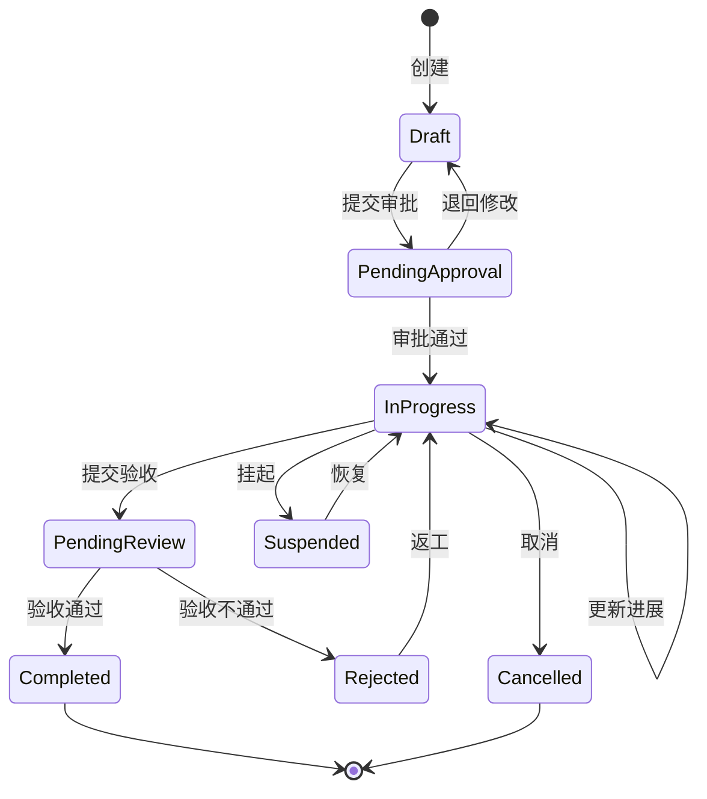

# 计划管理系统技术规格 (spec.md)

> 版本: 1.1 | 更新时间: 2026-02-08

## 1. 系统概述

**项目名称**: Plan Management System (PMS)  
**目标用户**: <50人规模企业  
**核心价值**: 任务全生命周期管理 + 量化绩效评价

---

## 2. 技术架构



### 2.1 技术栈明细

| 层级 | 技术选型 | 说明 |
| :--- | :--- | :--- |
| 前端 | Vue 3 + Vite + Tailwind CSS | 响应式设计，PWA 支持 |
| 后端 | Python 3.11+ FastAPI | 异步高性能 |
| ORM | SQLAlchemy 2.0 | 声明式模型 |
| 数据库 | PostgreSQL 15+ | 主数据存储 |
| 缓存 | Redis 7+ | 会话 + 定时任务队列 |
| 部署 | Docker Compose | 一键启动 (已优化支持 Docker 状态检测与端口就绪等待) |

---

## 3. 数据模型 (ER 图)



---

## 4. 任务状态机



**状态定义**:

- `draft` - 草稿（仅创建者可见）
- `pending_approval` - 待审批（等待 Manager 定级 I/D）
- `in_progress` - 进行中（开始计时）
- `pending_review` - 待验收（停止计时）
- `completed` - 已完成（已评分归档）
- `rejected` - 已驳回（返工，工期不重置）
- `cancelled` - 已取消
- `suspended` - 已挂起

---

## 5. 绩效算法

### 5.1 得分公式

$$S = \max(0, (B \times I \times D) \times Q \times T - P)$$

| 参数 | 名称 | 范围 | 说明 |
| :--- | :--- | :--- | :--- |
| B | 基准分 | 100 | 固定值 |
| I | 重要性 | 0.5-1.5 | Manager 设定 |
| D | 难度 | 0.8-1.5 | Manager 设定 |
| Q | 质量 | 0.0-1.2 | 验收时评分 |
| T | 时效 | 0.2-1.0 | 系统自动计算 |
| P | 罚分 | ≥0 | 红牌扣分 |

### 5.2 时效系数计算

$$T = \begin{cases} 1.0, & \Delta t \le 0 \\ \max(0.2, 1.0 - \frac{\Delta t}{D} \cdot f), & \Delta t > 0 \end{cases}$$

- Δt = 实际完成时间 - 计划完成时间
- D = 计划总工期
- f = 惩罚因子（默认 1.0）

### 5.3 红黄牌规则

| 类型 | 触发条件 | 处理 |
| :--- | :--- | :--- |
| 黄牌 | 距截止 24h 且进度 < 50% | 预警通知 |
| 红牌 | 逾期 > 3天 或 超期倍数 ≥ 1 | 生成考核单，扣除绩效分 |

---

## 6. API 设计 (RESTful)

### 6.1 认证模块

| 方法 | 路径 | 说明 |
| :--- | :--- | :--- |
| POST | `/api/auth/login` | 用户登录 |
| POST | `/api/auth/logout` | 用户登出 |
| GET | `/api/auth/me` | 当前用户信息 |

### 6.2 用户管理

| 方法 | 路径 | 说明 |
| :--- | :--- | :--- |
| GET | `/api/users` | 用户列表 |
| POST | `/api/users` | 创建用户 |
| GET | `/api/users/{id}` | 用户详情 |
| PUT | `/api/users/{id}` | 更新用户 |
| DELETE | `/api/users/{id}` | 删除用户 |

### 6.3 任务管理

| 方法 | 路径 | 说明 |
| :--- | :--- | :--- |
| GET | `/api/tasks` | 任务列表（支持过滤） |
| POST | `/api/tasks` | 创建任务 |
| GET | `/api/tasks/{id}` | 任务详情 |
| PUT | `/api/tasks/{id}` | 更新任务 |
| DELETE | `/api/tasks/{id}` | 删除任务 |
| POST | `/api/tasks/{id}/subtasks` | 创建子任务 |
| POST | `/api/tasks/{id}/submit` | 提交审批 |
| POST | `/api/tasks/{id}/approve` | 审批通过 |
| POST | `/api/tasks/{id}/reject` | 审批驳回 |
| POST | `/api/tasks/{id}/complete` | 提交验收 |
| POST | `/api/tasks/{id}/review` | 验收评分 |
| POST | `/api/tasks/{id}/transfer` | 任务转移 |
| GET | `/api/tasks/{id}/logs` | 任务日志 |
| POST | `/api/tasks/{id}/logs` | 添加进展日志 |

### 6.4 绩效与报表

| 方法 | 路径 | 说明 |
| :--- | :--- | :--- |
| GET | `/api/kpi/personal/{user_id}` | 个人绩效 |
| GET | `/api/kpi/department/{dept_id}` | 部门绩效 |
| GET | `/api/reports/weekly` | 周报生成 |
| GET | `/api/reports/monthly` | 月报生成 |
| GET | `/api/export/{format}` | 导出 (excel/pdf) |

### 6.5 申诉管理

| 方法 | 路径 | 说明 |
| :--- | :--- | :--- |
| GET | `/api/appeals` | 申诉列表 |
| POST | `/api/appeals` | 发起申诉 |
| POST | `/api/appeals/{id}/review` | 审核申诉 |

---

## 7. 前端页面结构

### 7.1 PC 端

```text
├── /login                    # 登录页
├── /dashboard               # 仪表盘（看板 + 风险预警）
├── /tasks                   # 任务列表（大表管理）
│   ├── /tasks/new           # 新建任务
│   └── /tasks/:id           # 任务详情
├── /kpi                     # 绩效统计
│   ├── /kpi/personal        # 个人绩效
│   └── /kpi/department      # 部门绩效
├── /reports                 # 报表中心
├── /settings                # 系统设置 (Admin)
│   ├── /settings/users      # 用户管理
│   ├── /settings/org        # 组织架构
│   └── /settings/params     # 参数配置
└── /help                    # 帮助说明
```

### 7.2 移动端

```bash
├── /m/tasks                 # 任务卡片列表
├── /m/tasks/:id             # 任务详情 + 进展更新
├── /m/notifications         # 通知中心
└── /m/profile               # 个人中心 + 申诉入口
```

---

## 8. 目录结构

```text
计划管理系统/
├── backend/
│   ├── app/
│   │   ├── api/             # API 路由
│   │   ├── core/            # 配置、安全
│   │   ├── models/          # SQLAlchemy 模型
│   │   ├── schemas/         # Pydantic 模式
│   │   ├── services/        # 业务逻辑
│   │   └── main.py
│   ├── alembic/             # 数据库迁移
│   ├── tests/               # 单元测试
│   └── requirements.txt
├── frontend/
│   ├── src/
│   │   ├── api/             # API 调用
│   │   ├── components/      # 通用组件
│   │   ├── views/           # 页面视图
│   │   ├── stores/          # Pinia 状态
│   │   ├── router/          # 路由配置
│   │   └── App.vue
│   ├── public/
│   └── package.json
├── docker/
│   ├── docker-compose.yml
│   ├── Dockerfile.backend
│   └── Dockerfile.frontend
├── log/
│   └── debug.log
├── plan.md
├── spec.md
├── readme.md
├── guide.md
```

## 10. UI/UX 视觉规格 (UI-UX Pro Max)

### 10.1 设计风格

- **核心概念**: Glassmorphism (玻璃质感)
- **视觉特征**: `backdrop-filter: blur(16px)`, `border: 1px solid rgba(255,255,255,0.2)`, `box-shadow` 深度感。
- **字体**:
  - `Poppins`: 用于 Logo, 标题, 数字统计 (强调现代感与专业度)。
  - `Open Sans`: 用于正文, 表单内容 (保证阅读可性度)。

### 10.2 色彩规范

| 角色 | 色值 | 渐变参考 |
| :--- | :--- | :--- |
| Primary | `#7C3AED` | `from-indigo-600 to-purple-600` |
| Accent | `#F97316` | `from-orange-500 to-amber-500` |
| Glass | `rgba(255,255,255,0.4)` | 配合 `backdrop-blur-xl` 使用 |

---
© 2026 Plan Master | 基于 UI-UX Pro Max 规范实现。

| 图表类型 | 状态 | 位置 |
| :--- | :--- | :--- |
| 系统架构图 | ✅ 必须 | 第2节 |
| ER 图 | ✅ 必须 | 第3节 |
| 状态图 | ✅ 必须 | 第4节 |
| 序列图 | ⚪ 可选 | 开发时补充 |
| 类图 | ⚪ 可选 | 开发时补充 |
| 部署图 | ⚪ 可选 | 部署阶段补充 |
