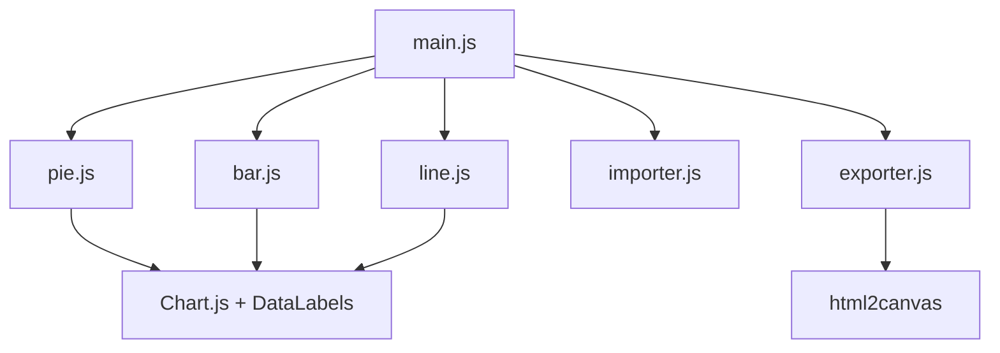
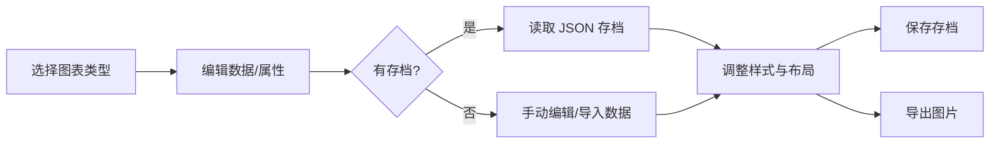

# Spec: Chart Studio

## 项目目标

创建一个基于 Web 的专业统计图表生成器，支持饼图、柱状图、折线图，具备高级视觉效果与离线存档功能。

## 模组关系图

## 用户操作流程

## 技术选型

| 模块 | 技术 |
|------|------|
| 核心框架 | 原生 JS (ES Modules) |
| 图表渲染 | Chart.js 4.x + Plugin DataLabels |
| 导出 | html2canvas + DataURL |
| 样式 | CSS 变量 + Glassmorphism (毛玻璃) |
| 持久化 | Local Files (JSON Archive) |

## 关键功能实现

- **PieChart**: 支持内部图例、旋转、百分比/数值双显。
- **Archive**: 全量备份应用状态至 JSON。
- **Exporter**: 自动适配主题的 JPG/PNG 生成。
