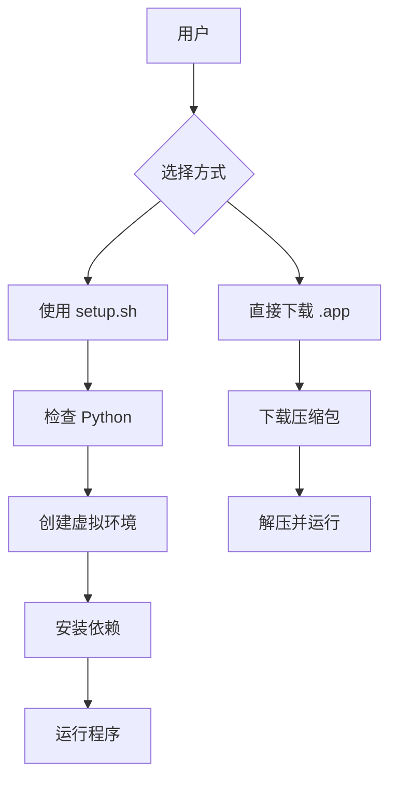

# 视频下载器分发与快速使用方案 (Spec)

## 1. 目标
让非技术用户能够快速安装并运行视频下载器，无需手动配置 Python 环境或安装复杂的依赖。

## 2. 方案概况
我们将提供三种快速使用方式：
1.  **一键安装脚本** (`setup.sh`): 自动化创建虚拟环境并安装依赖。
2.  **打包可执行程序**: 使用 PyInstaller 将程序打包为 macOS 的 `.app` 文件。
3.  **GitHub Release**: 托管打包好的二进制文件，用户下载即用。

## 3. 技术设计

### 3.1 一键安装脚本 (`setup.sh`)
- 检查系统是否安装了 Python 3。
- 创建 `.venv` 虚拟环境。
- 升级 `pip`。
- 安装 `requirements.txt` 中的依赖。
- 生成一个 `run.sh` 脚本，方便用户以后直接双击运行。

### 3.2 打包方案 (PyInstaller)
- 使用 `pyinstaller` 工具。
- 处理 Tkinter 的资源打包。
- 处理 `config_manager.py` 和 `history_manager.py` 的引用。
- 生成单文件模式或打包模式。

### 3.3 文档更新
- 更新 `README.md`，增加“快速开始”章节。
- 修正文档中目录名称不一致的问题 (youtube_downloader -> video_downloader)。

## 4. 关键流程

## 5. 待办事项
1. [ ] 创建 `setup.sh` 脚本。
2. [ ] 编写 PyInstaller 配置文件 `video_downloader.spec`。
3. [ ] 整合并修正 `README.md`。
4. [ ] 自动化打包脚本。
