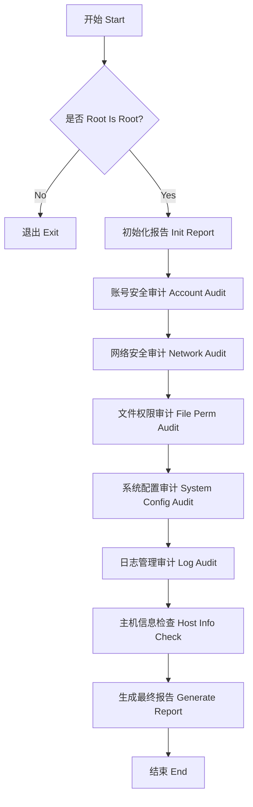

# 技术规格说明书 (Spec)

## 1. 项目范围

编写一个非破坏性的 Bash 脚本 (`audit.sh`)，用于审计 Ubuntu 24.04 (阿里云 ECS) 的安全性，并生成中英文双语报告。

## 2. 关键功能

### 2.1 审计维度

1. **账号安全**:
    - Root 账号锁定检查
    - 既然是阿里云，通常禁用 root 密码登录，使用 SSH Key。
    - 空口令用户检查 (`/etc/shadow`)
    - Sudo 权限检查 (NOPASSWD 风险)
2. **网络安全**:
    - 监听端口扫描 (`ss -tuljn`)
    - UFW 防火墙状态检查
    - SSH 配置检查 (`PermitRootLogin`, `PasswordAuthentication`, `Protocol`)
3. **文件系统权限**:
    - 敏感文件 (`/etc/passwd`, `/etc/shadow`, `/etc/group`, `/etc/gshadow`) 权限检查
    - 全局可写文件粘滞位 (Sticky bit) 检查
4. **系统配置**:
    - 内核参数 (`sysctl.conf`) 优化建议 (如 `net.ipv4.ip_forward`, `net.ipv4.conf.all.accept_redirects` 等)
    - 核心服务状态 (如 `ssh`, `ufw`, `auditd` 等)
5. **日志管理**:
    - Logrotate 配置检查
    - Auditd 服务状态检查
6. **全面主机信息检查** (系统、硬件、磁盘、网络)

### 2.2 输出规范

- 文件名: `security_audit_report.md`
- 语言: 中英文双语
- 格式: Markdown 表格
| 检查项 (Item) | 状态 (Status) | 风险等级 (Risk) | 建议 (Recommendation) |

## 3. 技术约束

- **语言**: Bash Shell
- **权限**: 必须以 Root 运行
- **安全性**: 只读操作，禁止修改系统配置
- **兼容性**: Ubuntu 24.04 LTS

## 4. Mermaid 流程图

