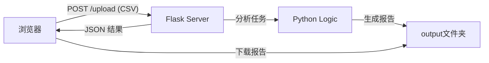
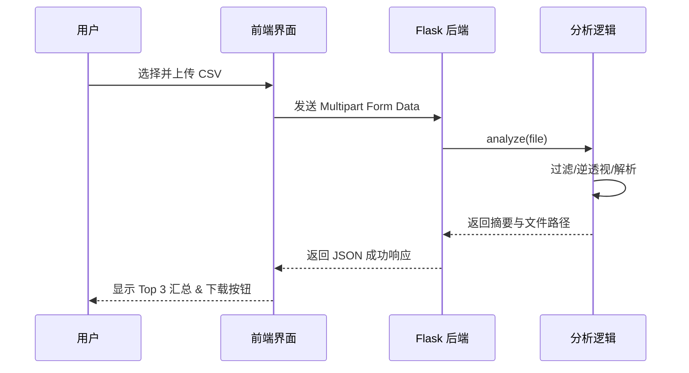

# Web 版技术规格 (spec.md)

## 1. 构架与选型 (必须)

```mermaid
graph LR
    User[浏览器] -- "POST /upload (CSV)" --> Backend[Flask Server]
    Backend -- "分析任务" --> Analyzer[Python Logic]
    Analyzer -- "生成报告" --> Output[output文件夹]
    Backend -- "JSON 结果" --> User
    User -- "下载报告" --> Output
```

## 2. 关键流程 (必须)

```mermaid
sequenceDiagram
    participant U as 用户
    participant F as 前端界面
    participant B as Flask 后端
    participant A as 分析逻辑

    U->>F: 选择并上传 CSV
    F->>B: 发送 Multipart Form Data
    B->>A: analyze(file)
    A->>A: 过滤/逆透视/解析
    A-->>B: 返回摘要与文件路径
    B-->>F: 返回 JSON 成功响应
    F-->>U: 显示 Top 3 汇总 & 下载按钮
```

## 3. API 规划 (必须)

- `POST /upload`: 接收文件并触发分析。
- `GET /download/<filename>`: 下载生成的报告。
