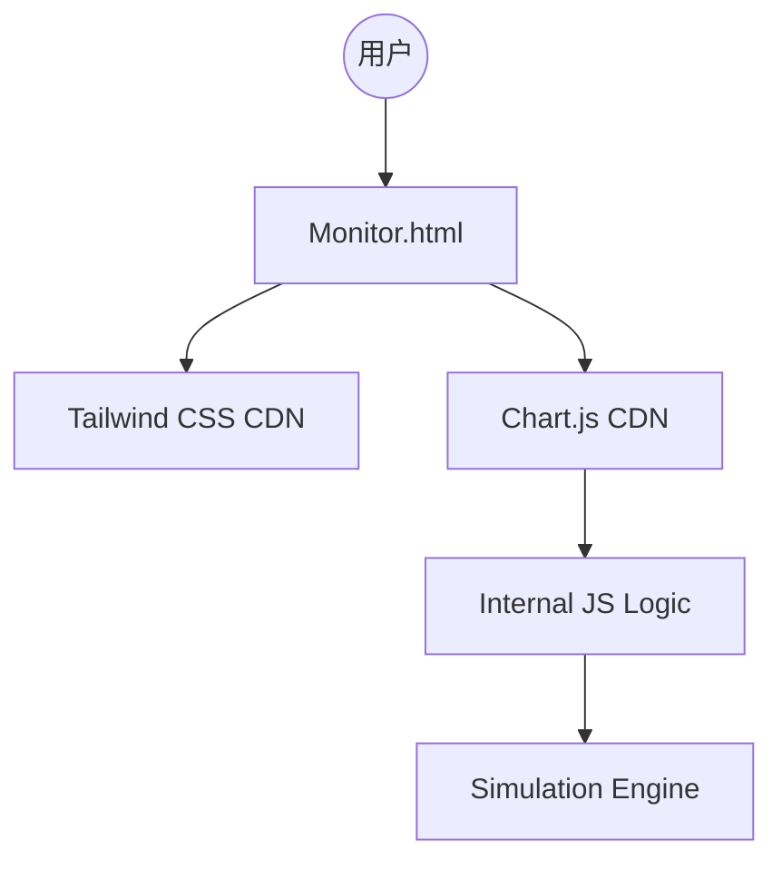
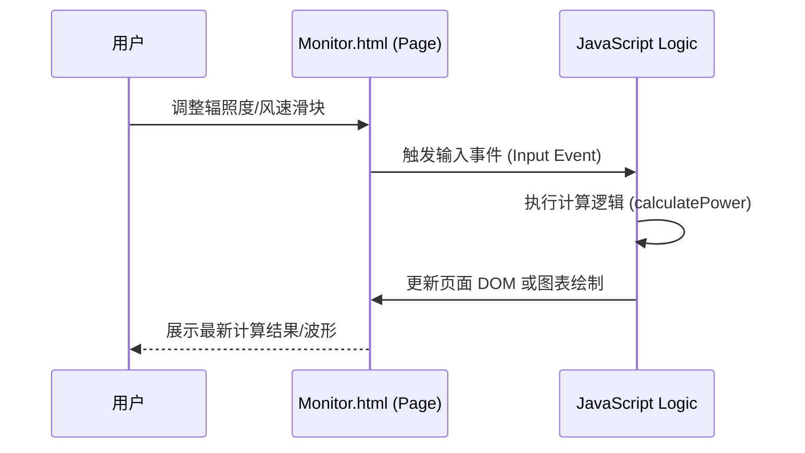
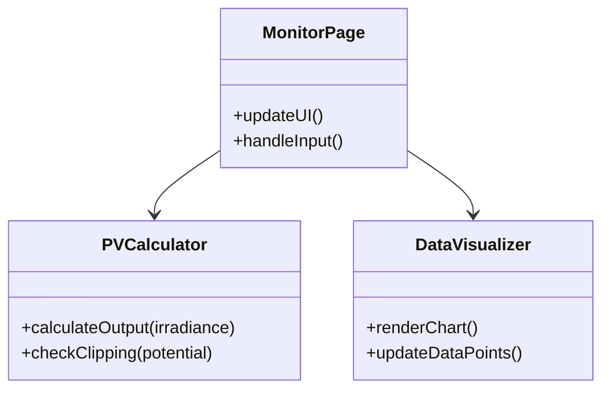

# New Energy Monitor - 项目规格说明书 (Spec)

## 1. 项目概述

本项目旨在开发一个“新能源监控平台”，采用**纯 HTML 静态网页**形式，用于实时监控、分析和预测太阳能光伏（PV）、风力发电（Wind）及储能系统（BESS）的运行状态。

## 2. 可行性评估

- **环境**: macOS 环境，仅需浏览器即可运行。
- **数据源**: 通过前端 Fetch 调用或模拟数据实现。
- **UI/UX**: 结合 Tailwind CSS 和 Chart.js，实现高端视觉效果。
- **结论**: 单文件 HTML 方案在性能和部署便捷性上均满足当前演示需求。

## 3. 核心功能 (Must)

- [ ] **多能源看板**: 实时展示光伏和风电的功率输出。
- [ ] **功率限流监测 (Clipping)**: 针对 140MWp DC / 100MW AC 的场景进行限效分析。
- [ ] **动态调节**: 使用交互式组件模拟环境参数变化。
- [ ] **效率分析**: 实时计算光伏 PR 值。
- [ ] **数据可视化**: 提供功率曲线与日出力分布图。
- [ ] **移动端应用 (New)**: 基于 React + Vite 的高保真移动端监控 App。

## 4. 架构与选型 (必须)

## 5. 关键流程 (必须)

## 6. 系统脉络图 (必须)

本项目是 `antigravity` 项目群的一部分，侧重于能源侧的监控演示，可与 `weather history` 项目的数据进行互补。

## 7. 模块关系图 (必须)

## 8. 日程与阶段

- **Phase 1**: 设计并实现核心计算逻辑。
- **Phase 2**: 创建中文化的高端单文件 UI。
- **Phase 3**: 集成 Open-Meteo API，实现多维天气信息获取与超短期功率预测。
- **Phase 4**: 优化单文件代码组织，确保易于维护。
- **Phase 5**: 开发 React 移动端版本，提供更佳的触屏交互体验。
