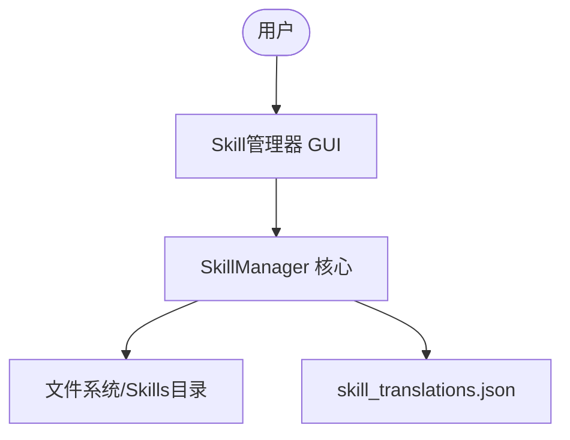
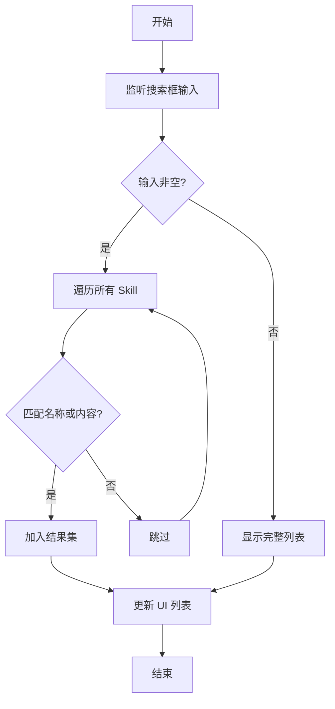
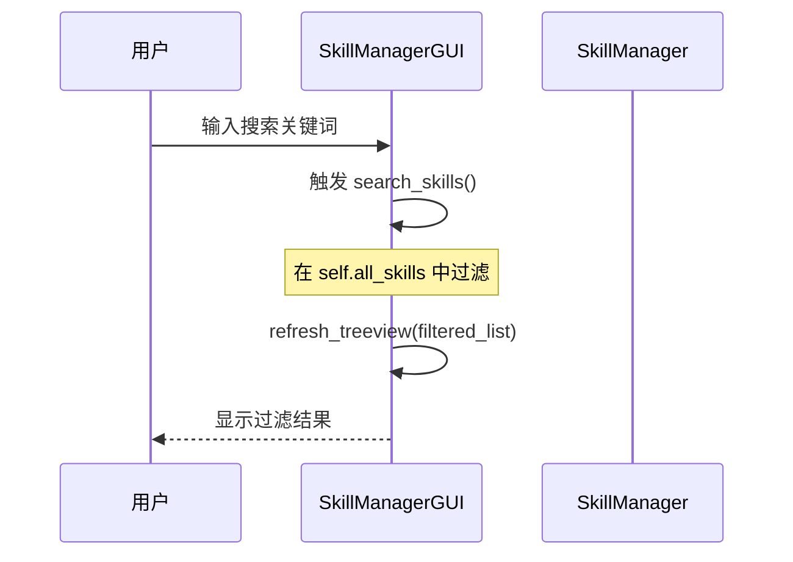
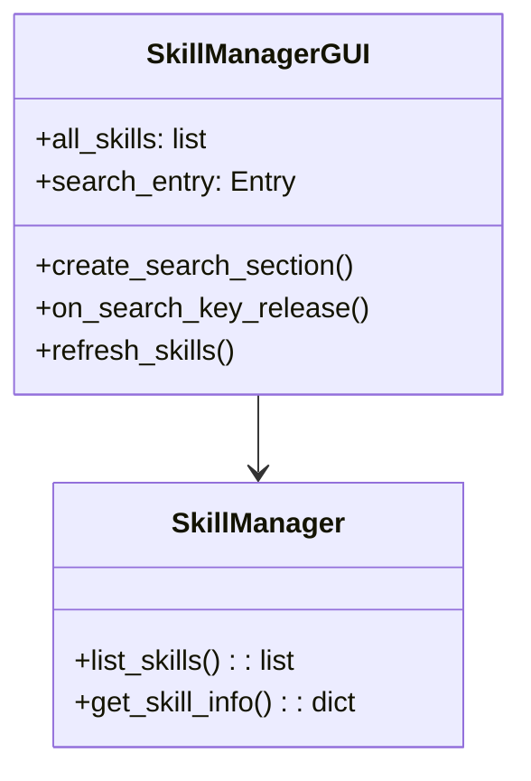
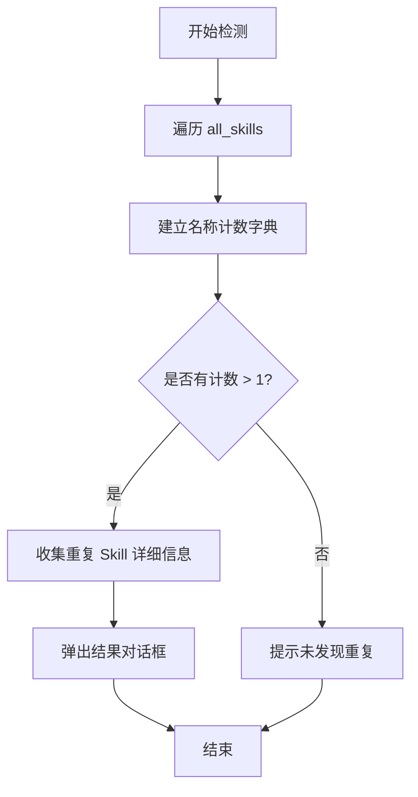

# Skill管理器 - 搜索功能设计文档 (spec.md)

## 1. 架构与选型
- **前端**: Python Tkinter (现有架构)
- **后端**: SkillManager (现有架构)
- **搜索机制**: 内存中过滤。将所有已安装的 Skill 加载到内存列表中，根据用户输入的关键词进行实时过滤。

## 2. 资料模型
搜索功能涉及到的主要数据模型是 Skill 信息对象：
```python
{
    "name": str,            # Skill 名称
    "version": str,         # 版本号
    "description": str,     # 英文描述
    "description_zh": str,  # 中文描述
    "path": str,            # 本地路径
    "source": str           # 来源 URL
}
```

## 3. 关键流程
### 搜索流程
1. 用户在搜索框输入文字。
2. 触发 `KeyRelease` 事件。
3. 获取输入框内容 `query`。
4. 遍历 `self.all_skills` 列表。
5. 匹配条件：
   - `query` 是否在 `name` 中（忽略大小写）。
   - `query` 是否在 `description` 或 `description_zh` 中（忽略大小写）。
6. 更新 `ttk.Treeview` 显示过滤后的结果。

## 4. Mermaid 图表

### 4.1 系统脉络图


### 4.2 搜索流程图


### 4.3 序列图


## 5. 虚拟码
```python
def on_search_change(query):
    query = query.lower()
    filtered_results = []
    for skill in all_skills:
        name_match = query in skill.name.lower()
        desc_match = query in skill.description.lower() or query in skill.description_zh.lower()
        if name_match or desc_match:
            filtered_results.append(skill)
    update_treeview(filtered_results)
```

## 6. 模组关系图

## 7. 重复名称检测功能
### 7.1 检测流程
1. 遍历 `self.all_skills` 记录所有 Skill 名称出现的次数。
2. 找出出现次数大于 1 的名称。
3. 如果存在重复，弹出对话框显示重复的 Skill 列表以及它们的详细路径。

### 7.2 重复检测流程图


## 8. 修复记录
### 8.1 Anthropic 官方 Skills 仓库地址修复
- **日期**: 2026-01-25
- **问题**: `sources.json` 和 `source_manager.py` 中的 Anthropic 官方仓库地址 `https://github.com/anthropics/anthropic-skills` 已失效，导致克隆失败。
- **修复方案**: 将 URL 更新为正确的 `https://github.com/anthropics/skills`。
- **涉及文件**:
    - `skill_manager/sources.json`
    - `skill_manager/source_manager.py`

### 8.2 批量删除与个体 Skill 卸载功能增强
- **日期**: 2026-01-25
- **问题**: 原有卸载逻辑仅支持单选，且卸载包中子 Skill 时会自动删除整个包（Repository），不符合精细化管理需求。
- **修复方案**:
    - 修改 `SkillManager.uninstall_skill` 支持接受具体路径，仅删除指定目录。
    - 增强 `SkillManagerGUI.uninstall_selected` 支持 Treeview 多选，并循环处理卸载逻辑。
    - 优化确认提示，区分独立 Skill 与包中子 Skill 的卸载后果。
- **涉及文件**:
    - `skill_manager/skill_manager.py`
    - `skill_manager/skill_manager_gui.py`
### 8.3 新增 "new-energy-safety-audit" 技能
- **日期**: 2026-01-28
- **背景**: 针对新能源（风、光、储）安全生产调度会材料审核需求，创建了专业化的审核专家 Skill。
- **功能**: 
    - 数据对标（参考 `references/stations.md`）。
    - 逻辑及计算审核（基于 `references/audit_rules.md`）。
    - 输出标准化报告（基于 `references/output_format.md`）。
- **注册**: 已在 `skill_manager/skills/skills_config.json` 中配置。

### 8.4 子模块一致性修复 (进行中)
- **问题**: 发现工程中存在 gitlink (160000) 但缺少 `.gitmodules` 文件。
- **修复方案**: 手动构建 `.gitmodules` 并关联 `anthropic-skills`、`awesome-claude-skills` 及 `weather history`。
