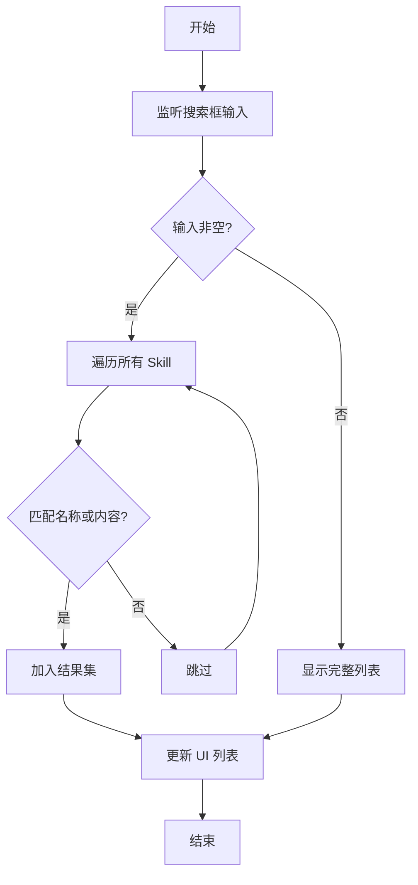
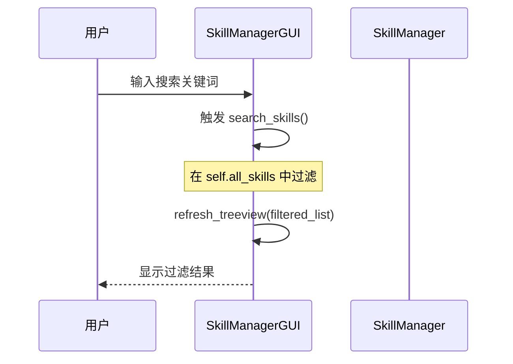
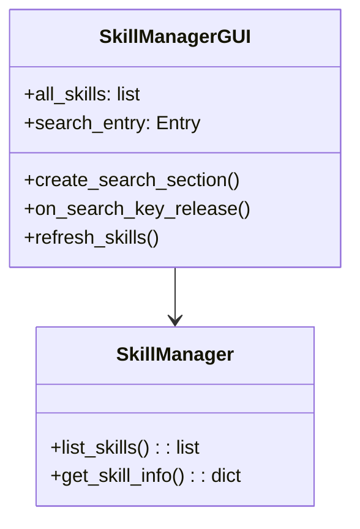

# Skill管理器 - 搜索功能设计文档 (spec.md)

## 1. 架构与选型
- **前端**: Python Tkinter (现有架构)
- **后端**: SkillManager (现有架构)
- **搜索机制**: 内存中过滤。将所有已安装的 Skill 加载到内存列表中，根据用户输入的关键词进行实时过滤。

## 2. 资料模型
搜索功能涉及到的主要数据模型是 Skill 信息对象：
```python
{
    "name": str,            # Skill 名称
    "version": str,         # 版本号
    "description": str,     # 英文描述
    "description_zh": str,  # 中文描述
    "path": str,            # 本地路径
    "source": str           # 来源 URL
}
```

## 3. 关键流程
### 搜索流程
1. 用户在搜索框输入文字。
2. 触发 `KeyRelease` 事件。
3. 获取输入框内容 `query`。
4. 遍历 `self.all_skills` 列表。
5. 匹配条件：
   - `query` 是否在 `name` 中（忽略大小写）。
   - `query` 是否在 `description` 或 `description_zh` 中（忽略大小写）。
6. 更新 `ttk.Treeview` 显示过滤后的结果。

## 4. Mermaid 图表

### 4.1 系统脉络图


### 4.2 搜索流程图


### 4.3 序列图


## 5. 虚拟码
```python
def on_search_change(query):
    query = query.lower()
    filtered_results = []
    for skill in all_skills:
        name_match = query in skill.name.lower()
        desc_match = query in skill.description.lower() or query in skill.description_zh.lower()
        if name_match or desc_match:
            filtered_results.append(skill)
    update_treeview(filtered_results)
```

## 6. 模组关系图

