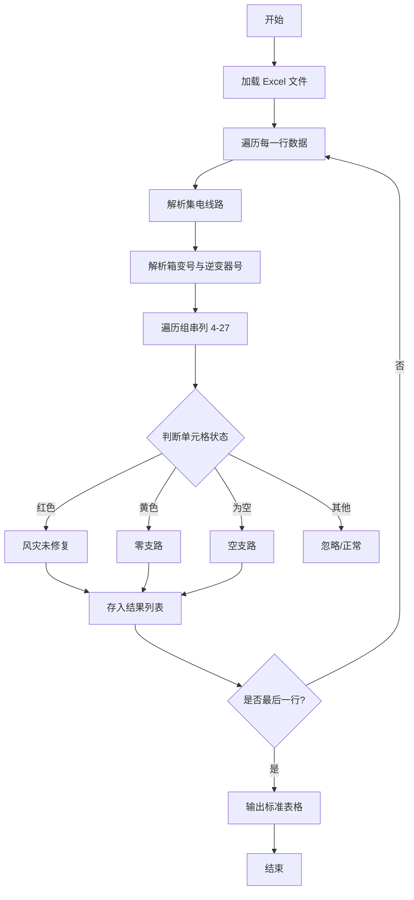

# Excel 数据处理规范 - 故障组串数据表

## 1. 项目背景

处理岑凡现场提供的故障组串 Excel 数据，将其转换为结构化的标准表格。

## 2. 输入输出

- **输入文件**: `岑凡现场提供故障组串数据表.xlsx`
- **输出文件**: `岑凡故障组串标准表.csv`

## 3. 处理逻辑

### 3.1 字段映射

| 目标字段 | 来源逻辑 |
| :--- | :--- |
| 集电线路 | 对应原表“集电线及方阵”列 |
| 箱变号 | 从“逆变器正式编号”解析（如 #1-1号逆变器 -> 1） |
| 逆变器号 | 从“逆变器正式编号”解析（如 #1-1号逆变器 -> 1） |
| 组串号 | 对应列号或单元格内容（1-24） |
| 组串状态 | 根据颜色和内容判断（见 3.2） |

### 3.2 状态判断规则

1. **空支路**: 组串列单元格为空（None/Empty）。
2. **风灾未修复**: 单元格背景颜色为 **红色** (`FFFF0000`)。
3. **零支路**: 单元格背景颜色为 **黄色** (`FFFFFF00`)。

*注：根据用户要求，最终表格仅包含上述三类故障/特定状态的支路。*

## 4. 图表要求 (Mermaid) - 必须

### 4.1 关键流程 (Flowchart)

## 5. 技术选型

- **语言**: Python 3.x
- **库**: `openpyxl` (用于颜色识别)

## 6. 验证 (单元测试)

- 验证颜色解析码。
- 验证箱变/逆变器号正则提取。
- 验证空值判定。
