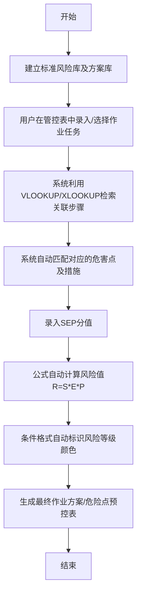

# 现场安全风险管控系统 设计文档 (spec.md)

## 1. 项目概况
本项目旨在建立一套基于电子表格（WPS/Excel）的现场作业安全风险管控系统，实现作业方案库、标准作业库及风险评估库的有机关联。

## 2. 构架与选型
*   **平台**: WPS Office / Microsoft Excel
*   **实现方式**: 利用 Excel 的多表关联、数据验证（下拉菜单）、公式计算及条件格式。
*   **核心逻辑**: 
    1. 用户在“作业填报表”中选择具体的“作业任务”。
    2. 系统自动匹配并拉取对应的“作业步骤”。
    3. 系统根据关联关系自动展示“危险点分析”及“预控措施”。
    4. 系统根据填入的 S/E/P 值自动计算风险值并判定风险等级。

## 3. 资料模型 (Data Model)
| 表名 | 关键字段 | 说明 |
| :--- | :--- | :--- |
| `01_标准风险库` | 作业任务, 作业步骤, 危害名称, 危害类别, 可能导致后果... | 存储所有已知的标准风险条目 |
| `02_方案模板库` | 方案名称, 作业项目, 具体工作内容 | 存储标准作业流程步骤 |
| `03_评估参数` | 后果(S), 暴露(E), 可能性(P), 风险等级标准 | 存储《规范》中的计算参数 |
| `04_风险管控表` | 任务选择, 自动生成步骤, 手动/自动填报S/E/P, 自动计算等级 | 用户操作主界面 |

## 4. 关键流程 (Flowchart)

## 5. 模块关系图 (Module Relationships)
*   **输入模块**: CSV 原始数据导入、用户手动录入。
*   **逻辑模块**: 计算公式、关联引用。
*   **输出模块**: 自动生成的风险管控表、作业方案表。

## 6. 图表要求 (Must/Optional)
*   **必须**: 流程图 (Mermaid), 资料模型 (Data Model)。
*   **可选**: 部署概况（本项目为单机表格，不涉及复杂部署）。

## 7. 风险评估公式
`风险值(R) = 后果(S) × 暴露(E) × 可能性(P)`
*   分值标准严格遵循《作业风险评估规范.md》。
