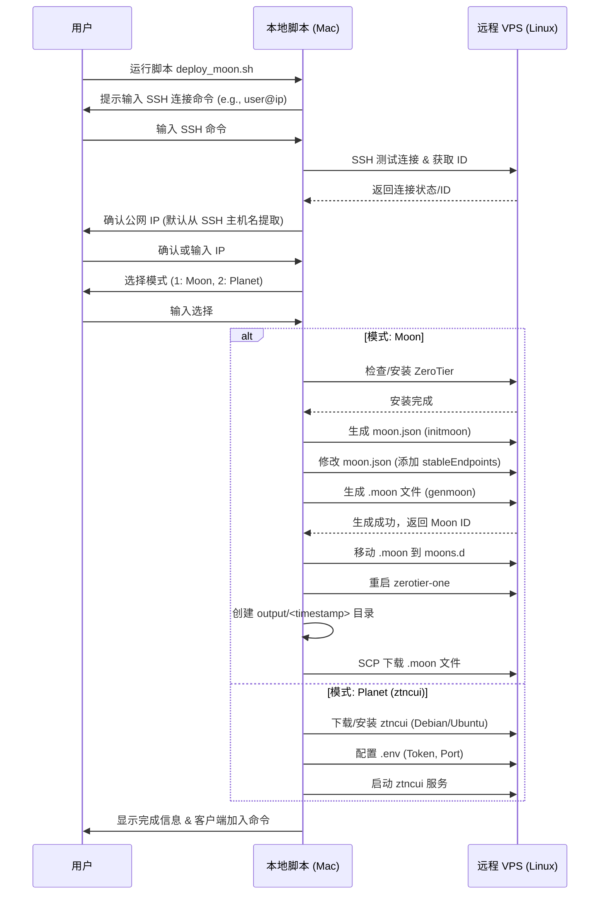

# ZeroTier Moon 部署脚本规格说明书 (Spec)

## 1. 项目概述

本项目旨在创建一个自动化脚本，用于通过 SSH 远程部署和配置 ZeroTier Moon 服务器。脚本运行在本地 macOS 环境，通过 SSH 连接到远程 VPS（通常是 Linux），完成安装、配置、生成 Moon 文件并回传等一系列操作。

## 2. 核心功能

1. **交互式配置**：
    * 接收用户输入的 SSH 连接命令 (如 `root@1.2.3.4`)。
    * 接收用户输入的 ZeroTier Network ID (可选)。
    * 确认或输入 Moon 服务器的公网 IP 和端口 (默认 9993)。
2. **远程环境检测与安装**：
    * 检测远程服务器是否安装 ZeroTier，若未安装则自动安装。
3. **Moon 配置生成**：
    * 生成 `moon.json` 模板。
    * 修改 `stableEndpoints` 字段配置公网 IP。
    * 生成签名后的 `.moon` 文件。
4. **Moon 部署**：
    * 创建 `moons.d` 目录。
    * 部署 `.moon` 文件。
    * 重启 ZeroTier 服务。
5. **Planet (ztncui) 部署**：
    * 下载并安装 ztncui (Debian/Ubuntu)。
    * 配置环境 (`.env`) 与服务启动。
6. **结果回传与归档**：
    * 将生成的 `.moon` 文件下载到本地 `output/` 目录。
    * 目录命名包含时间戳，如 `output/20231027_103055_<moon_id>/`。
    * 输出客户端加入 Moon 的命令提示。

## 3. 技术选型

* **开发语言**：Bash Shell Script
* **运行环境**：macOS (Local), Linux (Remote Target)
* **核心工具**：`ssh`, `scp`, `curl`, `zerotier-cli`, `zerotier-idtool`, `sed`/`jq`

## 4. 流程图 (Mermaid)



## 5. 目录结构

```text
zerotier moon/
├── README.md
├── spec.md
├── update.md
├── planning.md (Ref)
├── deploy_moon.sh (主程序)
└── output/ (构建产物)
```

## 6. 风险与约束

* **SSH 权限**：脚本假设用户可以使用提供的 SSH 命令无密码登录（公钥认证），或 SSH 客户端会处理密码交互。
* **依赖工具**：远程服务器需支持 `bash`。`jq` 是处理 JSON 的最佳实践，但为了兼容性，脚本将尝试检测 `jq`，若无则使用 `sed` 或 `python` 进行文本处理。
* **端口安全**：Moon 默认使用 UDP 9993 端口，脚本无法自动配置云厂商的防火墙/安全组，需在输出中提示用户放行端口。
