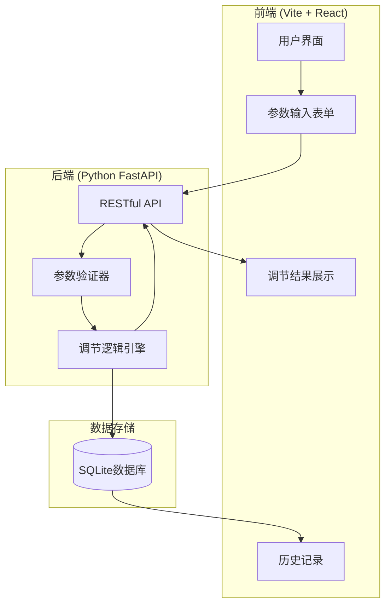
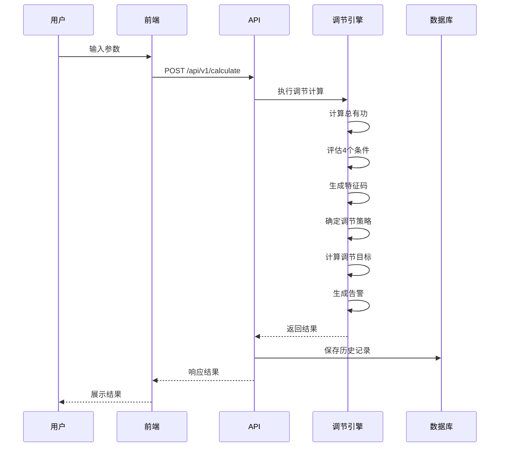
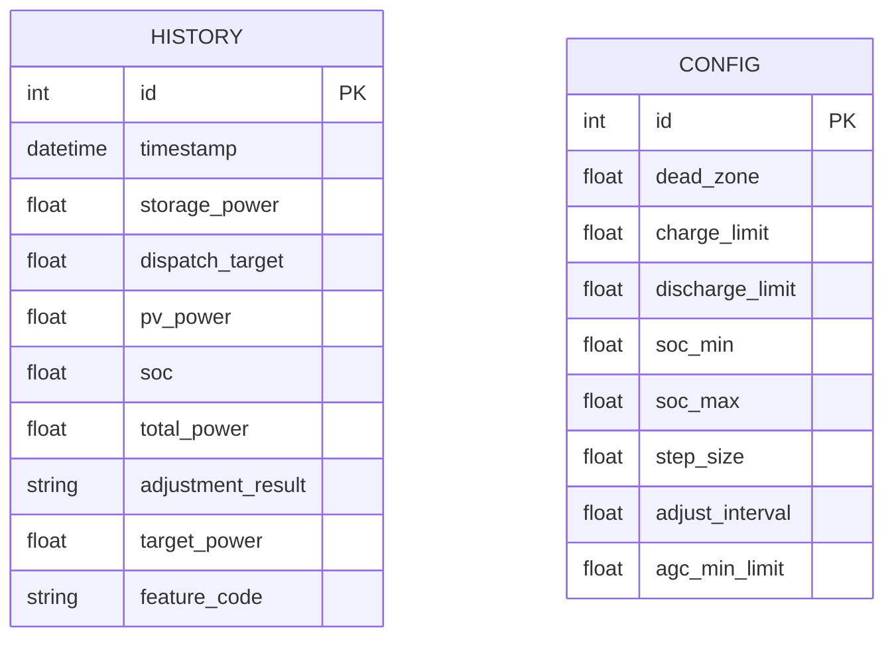
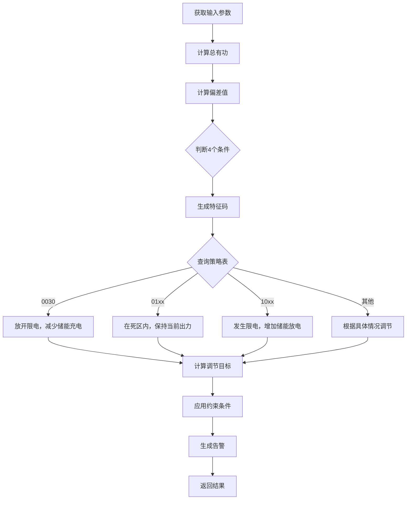

# 储能自动调节系统规格说明书

## 一、项目概述

### 1.1 项目背景

本系统为光储电站的储能自动调节系统，用于根据调度AGC指令、光伏出力、储能当前状态等参数，自动计算储能系统应如何调节出力。

### 1.2 核心公式

```
总有功 = 光伏出力 + 储能出力
储能调节目标 = 调度指令值 - 光伏出力
```

> **注意**：储能出力正值表示放电，负值表示充电

---

## 二、系统架构



---

## 三、核心流程



---

## 四、数据模型



---

## 五、条件判断逻辑

### 5.1 特征码系统

| 条件 | 描述 | 特征值 |
|------|------|--------|
| 条件1（是否限电） | 实际出力 < 调度指令 | 0=未限电, 1=限电 |
| 条件2（死区） | 调度目标与实际出力接近 | 0=不在死区, 1=在死区 |
| 条件3（充电速率） | 储能充电状态等级 | 0-3 |
| 条件4（在限值） | 储能是否超限 | 0=正常, 1=超限 |

### 5.2 调节策略映射



---

## 六、API接口

### 6.1 计算调节 - POST /api/v1/calculate

**请求：**

```json
{
  "storage_power": -12.0,
  "dispatch_target": 63.0,
  "pv_power": 73.0,
  "charge_limit": -30.0,
  "dead_zone": 1.2,
  "soc": 50.0
}
```

**响应：**

```json
{
  "total_power": 61.0,
  "adjustment_result": "放开限电，减少储能充电",
  "target_power": -10.0,
  "feature_code": "0030",
  "conditions": {
    "is_curtailed": false,
    "in_dead_zone": false,
    "charge_rate_level": 3,
    "in_limit": false
  },
  "deviation": 2.0,
  "need_adjust": true,
  "warnings": []
}
```

### 6.2 历史记录 - GET /api/v1/history

### 6.3 配置管理 - GET/PUT /api/v1/config

---

## 七、约束条件

| 参数 | 默认值 | 说明 |
|------|--------|------|
| 死区 | 1.2 MW | 偏差小于此值不调节 |
| 充电上限 | -50 MW | 最大充电功率 |
| 放电上限 | 50 MW | 最大放电功率 |
| SOC下限 | 8% | 低于此值停止放电 |
| SOC上限 | 100% | 高于此值停止充电 |
| AGC最小限制 | 3 MW | 低于此值不充电 |

---

## 八、必需 Mermaid 图表

- ✅ 系统架构图
- ✅ 核心流程序列图
- ✅ ER 图
- ✅ 策略流程图

## 九、可选 Mermaid 图表

- 类图（后端较简单，暂不需要）
- 状态图（无复杂状态机）
- 部署图（单机部署）
