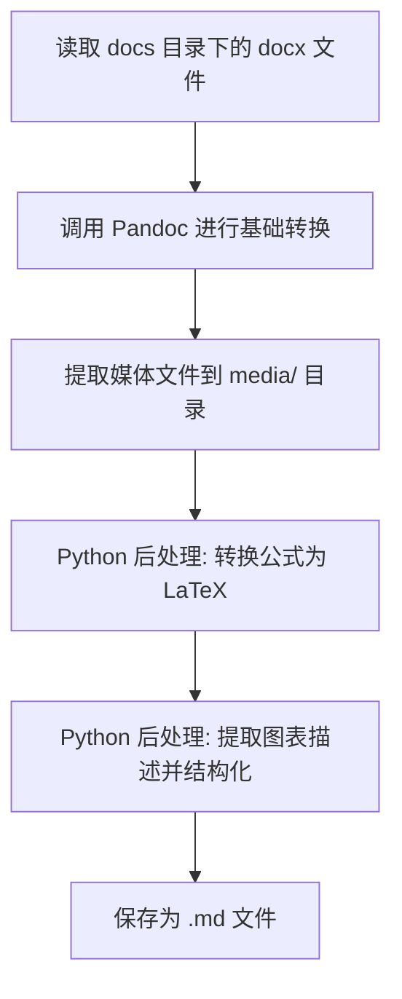

# 项目规格说明书 (spec.md)

## 1. 项目背景

将广西崇左及贵港地区风光资源研究相关的 .docx 文档转换为高可读性的 Markdown 格式，以便于后续的知识管理和 AI 处理。

## 2. 需求列表

- [核心] 将 .docx 文档转换为 Markdown。
- [核心] 提取图表描述（通常是以“图 x-x”或“表 x-x”开头的文本）。
- [核心] 将所有公式转换为标准 LaTeX 格式。
- [核心] 将所有表格还原为标准的 Markdown 表格。
- [扩展] 提取媒体文件（图片）并正确引用。

## 3. 架构与选型

- **工具**: Pandoc (v3.6+)
- **脚本语言**: Python (用于自动化处理和后处理)
- **输入目录**: `docs/`
- **输出目录**: `markdown/`

## 4. 关键流程 (Mermaid - 必须)

## 5. 资料模型 (可选)

不涉及复杂数据库。

## 6. 任务进度记录 (update.md)

详见 `update.md`。

## 7. 风险评估

- **公式转换**: 极复杂的嵌套公式可能需要手动校验。
- **图表识别**: 若图表描述没有统一的格式（如“图 1”），提取可能不完整。
- **大文件**: `中国风能太阳能资源年景公报` 较大，转换耗时较长。
