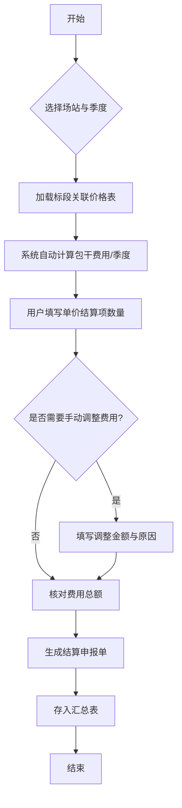
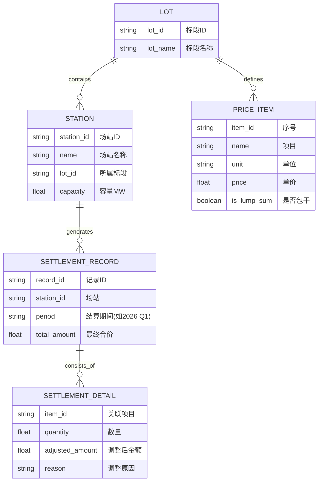
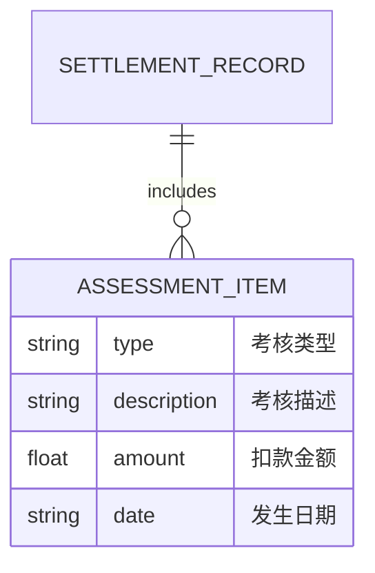

# 运维合同结算系统demo 详细设计文档

## 1. 概述

本项目是一个基于 HTML/JS 单文件实现的运维合同结算系统原型。旨在为真实业务开发提供参考，涵盖标段库管理、场站关联、季度结算逻辑、费用调增/调减量及汇总查阅功能。

## 2. 构架与选型

- **核心**: HTML5 / JavaScript (ES6+ / Vanilla JS)
- **外观**: CSS3 (Glassmorphism, Flexbox/Grid)
- **图标**: 使用 SVG 嵌入
- **存储**: 内存对象存储（模拟数据库），支持导出 JSON/Excel 逻辑

## 3. 关键流程

### 3.1 结算流程图

## 4. 资料模型

## 5. 必须功能点

1. **标段切换逻辑**: 切换不同的场站，自动根据其所属标段匹配对应的单价表。
2. **季度自动拆分**: 对于“是否包干=是”的项目，本季度费用默认为 `(合价 / 4)`。
3. **动态调整机制**: 提供“调整金额”输入框，当调整值不为 0 时，强制要求选择/填写支撑原因。
4. **考核项导入**: 支持从外部数据（模拟表格）导入考核项目（违约金/扣款），并自动从结算总额中扣除。
5. **汇总报表**: 提供全局视角，按标段/场站汇总统计已结算金额。

## 6. 扩展资料模型 (Assessment)

## 7. UI/UX 规范 (Pro Max)

- **配色**: 采用深色科技感或高级浅色模式（本系统采用高级浅色模式）。
- **交互**: 悬停高亮、平滑过渡、侧边栏导航。
- **反馈**: 实时计算（Real-time calc），数值变动即刻反映在总计中。
